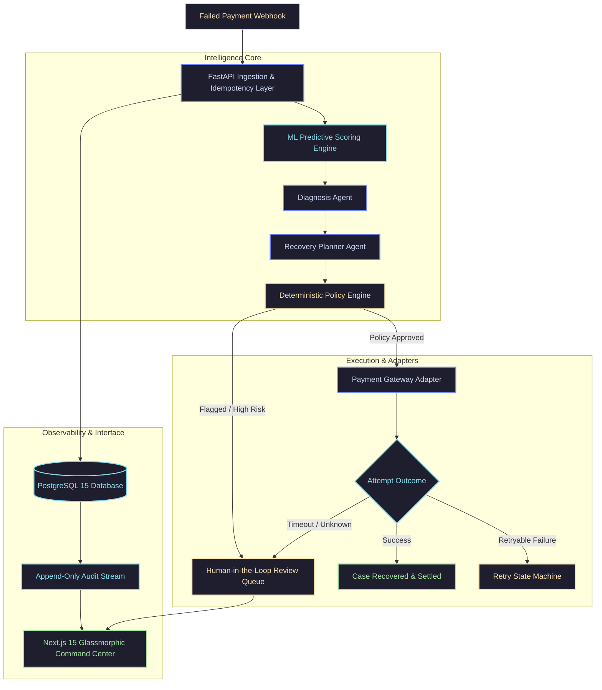

<div align="center">

# ⚡ RecoverAI

### Autonomous AI Revenue Recovery Operating System

**Recover failed payment transactions into settled revenue through predictive ML scoring, dual LLM agent reasoning, and deterministic policy safety guardrails.**

<br/>

[](https://www.python.org/)
[](https://fastapi.tiangolo.com/)
[](https://nextjs.org/)
[](https://www.typescriptlang.org/)
[](https://www.postgresql.org/)
[](https://www.docker.com/)
[-success?style=for-the-badge&logo=pytest&logoColor=white)](https://github.com/Mishesh06/Ai-Revenue-Recovery)
[](LICENSE)

<br/>

[🌟 Overview](#-overview) • [🏗️ Architecture](#-system-architecture) • [✨ Key Features](#-key-features) • [🚀 Quickstart](#-quickstart) • [🎮 Simulator Engine](#-simulation--replay-engine) • [📡 API Reference](#-api-reference) • [📚 Docs](#-documentation)

---

### 📊 Performance & Safety at a Glance

| 🎯 85%+ Recovery Rate | 🛡️ 100% Deterministic Safety | ⚡ < 250ms Decision Latency | 🔒 Multi-Tenant Isolated |
| :---: | :---: | :---: | :---: |
| On transient & soft payment failures | AI actions strictly bounded by rule policies | Instant root cause diagnosis & planning | Strict row-level PostgreSQL partitioning |

</div>

<br/>

---

## 🌟 Overview

Payment failures silently drain **hundreds of billions of dollars** from digital commerce annually. Most businesses rely on naive, static cron retries that annoy customers, inflate gateway chargeback fees, and trigger bank fraud flags.

**RecoverAI** replaces dumb retries with an intelligent, multi-layered revenue recovery engine:

```
Payment Failed ──► [1. ML Predictive Gate] ──► [2. Dual LLM Agents] ──► [3. Deterministic Policy] ──► [4. Resilient Execution] ──► Recovered Revenue
```

1. **Predictive ML Gate**: Instantly scores failed transactions on **Opportunity Score** and **Recovery Probability** before spending compute.
2. **Dual-Agent LLM Reasoning**:
   - **Diagnosis Agent**: Deeply examines raw gateway error logs, error codes, and customer history to uncover root causes (*Temporary Insufficient Funds* vs. *Hard Stolen Card*).
   - **Recovery Planner Agent**: Synthesizes the diagnosis into an optimal, multi-step recovery strategy (*Wait 72h, route via fallback gateway, dispatch customer UPI collect*).
3. **Deterministic Policy Guardrails**: AI agents propose; versioned policy engines dispose. Hard business rules guarantee safety (amount caps, risk ceilings, max retry thresholds).
4. **Resilient Execution & Idempotency**: All executions are guarded by unique database idempotency locks (`UNIQUE(idempotency_key)`), preventing duplicate charges.
5. **Real-Time Glassmorphic Command Center**: Full operational visibility with an interactive step-by-step scrubber, live decision stream, and human-in-the-loop review queues.

---

## 🏗️ System Architecture



---

## ✨ Key Features

### 🤖 Multi-Agent Orchestration & Reasoning
- **Diagnosis Agent**: Deep metadata extraction analyzing gateway decline codes, issuer bank latency, card brand behavior, and historical recovery signals.
- **Recovery Planner Agent**: Generates adaptive recovery workflows combining optimal delay windows, gateway routing fallbacks, and multi-channel customer communications.

### 🛡️ Deterministic Safety Guardrails
- **Zero Hallucination Risk**: AI agents never trigger payment adapters directly. Every proposed action is evaluated against active, versioned merchant policies.
- **Strict Constraints**: Automatically blocks actions exceeding merchant amount limits, confidence minimums, or maximum attempt thresholds.

### ⚡ Database-Level Idempotency & Fault-Tolerance
- **No Double Charges**: Cryptographically generated idempotency keys stored with strict PostgreSQL `UNIQUE` constraints guarantee exactly-once execution.
- **Graceful Timeout Failover**: Network timeouts automatically transition cases to `OUTCOME_UNKNOWN` and route to the **Human Review Queue**.

### 🏢 Enterprise Multi-Tenant Architecture
- **Complete Tenant Isolation**: Strict row-level merchant scoping via foreign-key constraints (`RESTRICT`) across all 21 database tables.
- **Tenant Context Middleware**: Validates and isolates every API call by `X-Merchant-ID`.

### 🔄 Non-Colliding State Machines
- Independent, dedicated state enums for every lifecycle stage:
  - `RecoveryCase` (`NEW` → `INVESTIGATING` → `RECOVERY_PLANNED` → `EXECUTING` → `RECOVERED` / `FAILED` / `CLOSED`)
  - `RecoveryAction` (`PENDING` → `EXECUTING` → `SUCCEEDED` → `FAILED`)
  - `RecoveryAttempt` (`STARTED` → `SUCCEEDED` → `FAILED` → `TIMEOUT`)

### 📜 Append-Only Immutable Audit Trail
- Every transaction event, AI decision rationale, policy evaluation, and gateway payload is recorded immutably with microsecond timestamps.

---

## 🚀 Quickstart

### Option 1: Run with Docker Compose (Recommended)

Start the full stack (PostgreSQL, FastAPI Backend, Next.js Frontend) in one command:

```bash
docker compose up --build
```

| Service | URL | Description |
|---|---|---|
| **Frontend Command Center** | `http://localhost:3000` | Glassmorphic management dashboard & simulator |
| **FastAPI Backend Core** | `http://localhost:8000` | REST API & agent orchestration engine |
| **Interactive OpenAPI Docs** | `http://localhost:8000/docs` | Swagger UI with test payloads |

---

### Option 2: Local Development Setup

#### Prerequisites
- **Python**: 3.11+
- **Node.js**: 18+ (Node 20 recommended)
- **PostgreSQL**: 14+

#### 1. Clone the Repository
```bash
git clone https://github.com/Mishesh06/Ai-Revenue-Recovery.git
cd Ai-Revenue-Recovery
```

#### 2. Backend Setup
```bash
cd recoverai/backend
python3 -m venv .venv
source .venv/bin/activate    # On Windows: .venv\Scripts\activate
pip install -r requirements.txt

# Configure environment
cp .env.example .env
# Edit .env with your PostgreSQL credentials

# Initialize database schema & seed realistic demo data
python scripts/init_db.py
python scripts/seed_demo.py

# Launch FastAPI server
uvicorn app.main:app --reload --port 8000
```

#### 3. Frontend Setup
```bash
cd ../frontend
npm install
cp .env.example .env.local

# Launch Next.js dev server
npm run dev
```

Open `http://localhost:3000` and use default Demo Merchant ID: `aaaaaaaa-0000-4000-8000-aaaaaaaaaaaa`.

---

## 🧪 Testing & Quality Assurance

RecoverAI maintains an exhaustive, production-grade test suite covering unit logic, integration flows, tenant isolation, and ML pipelines:

```bash
# Run the complete test suite
make test

# Or run individual suites
make test-backend   # 563 pytest cases (100% pass)
make test-ml        # ML predictive pipeline tests
make test-frontend  # TypeScript typecheck & Next.js production build
```

```
============================== Test Summary ==============================
  Backend Suite (pytest)     : 563 passed, 0 failed (100%)
  ML Pipeline Suite          : 5 passed, 0 failed (100%)
  Frontend Production Build  : 12 routes generated, 0 TypeScript errors
==========================================================================
```

---

## 🎮 Simulation & Replay Engine

RecoverAI features an interactive simulation engine allowing teams to test, replay, and debug the complete recovery pipeline without incurring payment gateway charges.

```
PaymentFailed 
  └── OpportunityDetected (Score: 0.88)
        └── PredictionCreated (Recovery Prob: 85%)
              └── DiagnosisCreated (Cause: Insufficient Funds)
                    └── RecoveryPlanned (Strategy: Delay + Fallback Gateway)
                          └── PolicyEvaluated (Status: APPROVED)
                                └── RecoveryExecuted
                                      └── AttemptStarted
                                            └── RecoverySucceeded
                                                  └── CaseRecovered & Closed
```

### 🎯 Pre-Configured Scenarios:
- **Scenario A (Normal Recovery)**: Transient insufficient funds → 72-hour delay window → Alternate gateway retry → Succeeded.
- **Scenario B (Policy Rejection)**: High fraud risk score exceeding merchant risk threshold → Policy engine blocks recovery.
- **Scenario C (Gateway Timeout)**: Network partition / adapter timeout → Automatically routed to **Human Review Queue**.

---

## 📡 API Reference

All endpoints require the `X-Merchant-ID` header for tenant-scoped operations.

| Method | Endpoint | Description |
|---|---|---|
| `GET` | `/health` | System health check, database status, and version |
| `GET` | `/api/dashboard` | Aggregated merchant KPIs (Revenue, Recovery Rate, Active Cases) |
| `GET` | `/api/recovery` | Paginated recovery cases with state, confidence, and timestamps |
| `GET` | `/api/recovery/{id}` | Complete case metadata, transaction details, and action history |
| `GET` | `/api/recovery/{id}/trace` | Chronological decision trace tree from ML to execution |
| `GET` | `/api/audit` | Append-only audit stream filterable by case or correlation ID |
| `GET` | `/api/review` | Pending human-in-the-loop review queue |
| `POST` | `/api/review/{id}/decision`| Approve, reject, or override recovery action |
| `POST` | `/api/simulations` | Execute end-to-end sandbox recovery scenario |
| `GET` | `/api/agents/status` | Real-time health, latency, and success rates for AI agents |
| `GET` | `/api/policies` | Active and historical versioned merchant policy rules |

Interactive Swagger documentation is available at `http://localhost:8000/docs`.

---

## 📁 Repository Structure

```
recoverai/
├── docs/                      # Comprehensive architectural documentation
│   ├── README.md              # Documentation navigation index
│   ├── database.md            # PostgreSQL schema & 21-table reference
│   ├── entity-relationships.md# Foreign key mappings & ER diagrams
│   ├── api-contract.md        # Complete REST API specification
│   ├── ai-layer.md            # LLM multi-agent design & prompt templates
│   ├── ml.md                  # Predictive scoring & model registry
│   ├── action-adapters.md     # Gateway integrations & idempotency
│   ├── simulator.md           # Simulation & decision trace engine
│   └── frontend-foundation.md # Next.js 15 UI design system
├── recoverai/
│   ├── backend/               # FastAPI async core + SQLAlchemy 2.0
│   │   ├── app/
│   │   │   ├── api/           # Route handlers & dependency injection
│   │   │   ├── models/        # SQLAlchemy ORM models (21 tables)
│   │   │   ├── schemas/       # Pydantic request/response schemas
│   │   │   ├── services/      # Business logic & tenant context
│   │   │   ├── agents/        # Diagnosis & Recovery Planner agents
│   │   │   ├── policies/      # Deterministic policy engine
│   │   │   ├── orchestrator/  # State machine lifecycle coordinators
│   │   │   ├── adapters/      # Razorpay & Simulation adapters
│   │   │   └── database/      # Async engine, session & base
│   │   ├── scripts/           # DB initialization & demo seeding
│   │   ├── tests/             # 563 pytest integration tests
│   │   └── Dockerfile
│   ├── frontend/              # Next.js 15 Glassmorphic Command Center
│   │   ├── src/app/           # 12 fully-typed route pages
│   │   ├── src/components/    # Reusable UI & simulator components
│   │   ├── src/context/       # Merchant context provider
│   │   ├── src/lib/           # API client & currency formatting
│   │   └── Dockerfile
│   └── ml/                    # Machine Learning pipeline
│       ├── data/              # Dataset generators & training samples
│       ├── models/            # Model registry & serialized artifacts
│       ├── training/          # Scikit-learn training pipelines
│       └── evaluation/        # Precision/recall & ROC metrics
├── docker-compose.yml         # Multi-container orchestration
├── Makefile                   # Developer CLI shortcuts
├── LICENSE                    # MIT License
└── CONTRIBUTING.md            # Contribution guidelines
```

---

## 📚 Technical Documentation Hub

For deep architectural specifications, check our [Documentation Hub](docs/README.md):

- [📖 Database Architecture](docs/database.md) — Detailed table definitions, foreign keys, and indexes.
- [🔗 Entity Relationships](docs/entity-relationships.md) — Visual ER mappings across the recovery lifecycle.
- [📝 API Contract](docs/api-contract.md) — Request/response schemas, error definitions, and status codes.
- [🧠 AI Multi-Agent System](docs/ai-layer.md) — Prompt design, reasoning chains, and agent status telemetry.
- [📈 Machine Learning Pipeline](docs/ml.md) — Feature engineering, training workflow, and model registry.
- [🔌 Action Adapters & Gateways](docs/action-adapters.md) — Payment gateway adapters and retry mechanisms.
- [🎮 Simulation & Scrubber Engine](docs/simulator.md) — Sandbox execution and decision trace replay.
- [🎨 Frontend Design System](docs/frontend-foundation.md) — Glassmorphic tokens, charts, and layout components.

---

## 👥 Contributing

Contributions are welcome! Please check our [Contributing Guidelines](CONTRIBUTING.md) and [Code of Conduct](CODE_OF_CONDUCT.md) before opening a pull request.

---

## 📄 License

This project is open-source software licensed under the [MIT License](LICENSE).

<br/>

<div align="center">
  <sub>Built with ❤️ by <strong>Mishesh Patel</strong> for autonomous revenue recovery.</sub>
</div>
