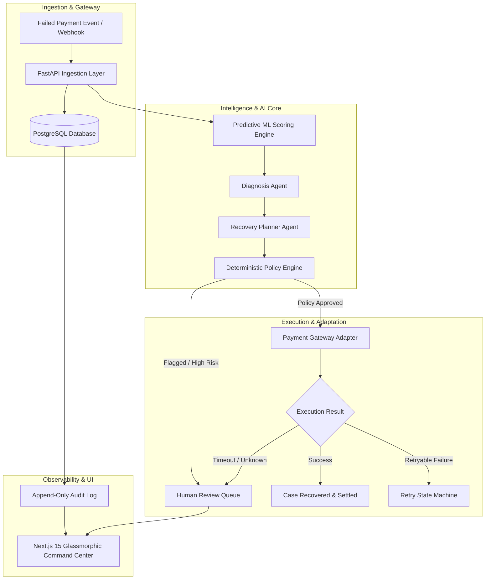

<div align="center">

# ⚡ RecoverAI v3.2

### The Autonomous AI Revenue Recovery Operating System

An enterprise-grade, multi-tenant platform designed to turn failed payment transactions into recovered revenue through predictive machine learning, dual LLM agent reasoning, and deterministic policy safety guardrails.

[](https://www.python.org/)
[](https://fastapi.tiangolo.com/)
[](https://nextjs.org/)
[](https://www.typescriptlang.org/)
[](https://www.postgresql.org/)
[](https://www.docker.com/)
[-success)](https://github.com/)
[](LICENSE)

[Architecture](#-system-architecture) • [Key Features](#-key-features) • [Quickstart](#-quickstart) • [Simulation Scenarios](#-simulation--replay-engine) • [API Reference](#-api-reference) • [Documentation](#-documentation)

</div>

---

## 🌟 Overview

Payment failures cost global digital commerce hundreds of billions annually. Traditional recovery relies on blunt, static cron retries that degrade customer trust and trigger issuer fraud flags. 

**RecoverAI** replaces dumb retries with an intelligent, multi-layered decision engine:

1. **Predictive ML Gate**: Evaluates payment metadata, transaction history, and failure patterns to compute an instant Opportunity Score and Recovery Probability.
2. **Dual-Agent LLM Reasoning**:
   - **Diagnosis Agent**: Deeply inspects raw gateway response codes, error payloads, and customer history to diagnose root causes (e.g. *Temporary Insufficient Funds* vs. *Hard Stolen Card*).
   - **Recovery Planner Agent**: Formulates a customized, time-delayed, multi-step recovery strategy (e.g. *Wait 72 hours, switch gateway routing to fallback adapter, request UPI collect*).
3. **Deterministic Policy Guardrails**: No AI output executes directly without deterministic validation against active, versioned merchant policies (amount caps, risk ceilings, max retry thresholds).
4. **Resilient Execution & Idempotency**: All dispatches are governed by strict database-level unique idempotency keys (`UNIQUE(idempotency_key)`), eliminating duplicate billing risks.
5. **Real-Time Glassmorphic Command Center**: Full operational visibility with live decision stream replay, interactive step-by-step timeline, and human-in-the-loop escalation queues.

---

## 🏗️ System Architecture



---

## ✨ Key Features

| Capability | Description |
|---|---|
| 🤖 **Dual-Agent Collaboration** | Specialized LLM agents for root-cause diagnosis and multi-step recovery planning with full reasoning chains. |
| 🛡️ **Deterministic Safety Engine** | Versioned merchant policies enforce hard limits on confidence, maximum retry attempts, and transaction amounts. |
| ⚡ **Database-Level Idempotency** | Cryptographically guaranteed single-execution protection preventing duplicate charge attempts across retries. |
| 🏢 **Enterprise Tenant Isolation** | Strict row-level merchant scoping with foreign-key constraints (`RESTRICT`) across all business tables. |
| 🔄 **Non-Colliding State Machines** | Distinct lifecycle states for `RecoveryCase`, `RecoveryAction`, and `RecoveryAttempt` with strict transitions. |
| 📜 **Append-Only Audit Trail** | Immutable record of every event, agent run, policy decision, and gateway payload with microsecond precision. |
| 🎮 **Interactive Simulation Replay** | Step-by-step visual scrubber and real-time decision stream with expandable JSON technical drawers. |
| 🌐 **Glassmorphic Command UI** | High-performance Next.js 15 interface featuring INR currency formatting, dynamic KPI cards, and instant filtering. |

---

## 🚀 Quickstart

### Option 1: Docker Compose (Recommended)

Run the entire application stack (PostgreSQL, FastAPI Backend, Next.js Frontend) with a single command:

```bash
docker compose up --build
```

- **Frontend Command Center**: `http://localhost:3000`
- **FastAPI Backend API**: `http://localhost:8000`
- **Interactive OpenAPI Docs**: `http://localhost:8000/docs`

---

### Option 2: Local Development Setup

#### Prerequisites
- **Python**: 3.11+
- **Node.js**: 18+ (Node 20 recommended)
- **PostgreSQL**: 14+

#### 1. Clone the Repository
```bash
git clone https://github.com/<your-username>/recoverai.git
cd recoverai
```

#### 2. Backend Setup
```bash
cd recoverai/backend
python3 -m venv .venv
source .venv/bin/activate    # On Windows: .venv\Scripts\activate
pip install -r requirements.txt

# Configure environment
cp .env.example .env
# Edit .env with your local PostgreSQL credentials

# Initialize database tables and seed demo data
python scripts/init_db.py
python scripts/seed_demo.py

# Start FastAPI dev server
uvicorn app.main:app --reload --port 8000
```

#### 3. Frontend Setup
```bash
cd ../frontend
npm install
cp .env.example .env.local

# Start Next.js dev server
npm run dev
```

Visit `http://localhost:3000` and use default Demo Merchant ID: `aaaaaaaa-0000-4000-8000-aaaaaaaaaaaa`.

---

## 🧪 Testing & Validation

RecoverAI maintains an exhaustive, production-grade test suite covering unit, integration, multi-tenant isolation, state machines, and ML pipelines:

```bash
# Run all test suites
make test

# Or run individual test targets
make test-backend   # 560+ pytest cases (100% pass)
make test-ml        # ML predictive pipeline tests
make test-frontend  # TypeScript typecheck & Next.js production build
```

---

## 🎮 Simulation & Replay Engine

RecoverAI includes a built-in interactive simulator to validate the entire orchestration pipeline against realistic payment failure scenarios without incurring gateway fees:

```
PaymentFailed 
  └── OpportunityDetected (Score: 0.88)
        └── PredictionCreated (Recovery Prob: 85%)
              └── DiagnosisCreated (Cause: Insufficient Funds)
                    └── RecoveryPlanned (Strategy: Delay + Fallback Gateway)
                          └── PolicyEvaluated (Status: APPROVED)
                                └── RecoveryExecuted
                                      └── AttemptStarted
                                            └── RecoverySucceeded
                                                  └── CaseRecovered & Closed
```

### Pre-Configured Scenarios:
- **Scenario A (Normal Recovery)**: Transient insufficient funds → 72-hour delay → Fallback gateway retry → Succeeded.
- **Scenario B (Policy Rejection)**: High fraud score / exceeding merchant max attempt ceiling → Policy engine blocks recovery.
- **Scenario C (Gateway Timeout)**: Network partition → Outcome `UNKNOWN` → Automatically routed to **Human Review Queue**.

---

## 📡 API Reference

| Method | Endpoint | Description |
|---|---|---|
| `GET` | `/health` | System health, database connection status, and service version |
| `GET` | `/api/dashboard` | Merchant KPIs (Total Revenue, Recovery Rate, Active Cases, AI Latency) |
| `GET` | `/api/recovery` | Paginated recovery cases with state, confidence, and financial attributes |
| `GET` | `/api/recovery/{id}` | Detailed recovery case metadata, transaction details, and action history |
| `GET` | `/api/recovery/{id}/trace` | Full chronological decision trace from ML to execution |
| `GET` | `/api/audit` | Append-only immutable audit trail filterable by correlation or case ID |
| `GET` | `/api/review` | Pending human-in-the-loop review cases |
| `POST` | `/api/review/{id}/decision`| Approve, reject, or override recovery action |
| `POST` | `/api/simulations` | Execute end-to-end sandbox recovery scenario |
| `GET` | `/api/agents/status` | Real-time health, latency, and success metrics for all AI agents |
| `GET` | `/api/policies` | Active and historical versioned merchant policy rules |

Full OpenAPI interactive documentation available at `http://localhost:8000/docs`.

---

## 📁 Repository Structure

```
recoverai/
├── docs/                      # Comprehensive architectural documentation
│   ├── database.md            # PostgreSQL schema & table specifications
│   ├── entity-relationships.md# Foreign key mappings & ER diagrams
│   ├── api-contract.md        # Complete REST API specification
│   ├── ai-layer.md            # LLM multi-agent design & prompts
│   ├── ml.md                  # Predictive scoring & model evaluation
│   ├── action-adapters.md     # Gateway integrations & idempotency
│   ├── simulator.md           # Simulation & decision trace engine
│   └── frontend-foundation.md # Next.js 15 UI design system
├── recoverai/
│   ├── backend/               # FastAPI async core
│   │   ├── app/
│   │   │   ├── api/           # API routes & dependency injection
│   │   │   ├── models/        # SQLAlchemy 2.0 ORM models (21 tables)
│   │   │   ├── schemas/       # Pydantic request/response schemas
│   │   │   ├── services/      # Business logic & tenant context
│   │   │   ├── agents/        # Diagnosis & Recovery Planner agents
│   │   │   ├── policies/      # Deterministic policy engine
│   │   │   ├── orchestrator/  # State machine lifecycle coordinators
│   │   │   ├── adapters/      # Razorpay & Simulation adapters
│   │   │   └── database/      # Async engine, session & base
│   │   ├── scripts/           # DB initialization & demo seeding
│   │   ├── tests/             # 560+ pytest integration tests
│   │   └── Dockerfile
│   ├── frontend/              # Next.js 15 Glassmorphic Command Center
│   │   ├── src/
│   │   │   ├── app/           # App Router pages (12 routes)
│   │   │   ├── components/    # Reusable UI & simulator components
│   │   │   ├── context/       # Merchant context provider
│   │   │   └── lib/           # API client & currency formatting
│   │   └── Dockerfile
│   └── ml/                    # Machine Learning pipeline
│       ├── data/              # Dataset generators & training samples
│       ├── models/            # Model registry & serialized artifacts
│       ├── training/          # Scikit-learn training pipelines
│       └── evaluation/        # Precision/recall & ROC metrics
├── .github/                   # GitHub Actions CI & issue templates
│   ├── workflows/             # Automated test & build pipelines
│   └── ISSUE_TEMPLATE/        # Bug reports & feature requests
├── docker-compose.yml         # Multi-container orchestration
├── Makefile                   # Developer CLI shortcuts
├── LICENSE                    # MIT License
└── CONTRIBUTING.md            # Contribution guidelines
```

---

## 📚 Documentation

For in-depth architectural guides, refer to the [Documentation Hub](docs/README.md):
- [Database Architecture & Schema Reference](docs/database.md)
- [Entity Relationships & Trace Chain](docs/entity-relationships.md)
- [Complete API Contract](docs/api-contract.md)
- [AI Multi-Agent Architecture](docs/ai-layer.md)
- [Machine Learning Recovery Scoring](docs/ml.md)
- [Simulation & Replay Engine](docs/simulator.md)
- [Action Adapters & Gateway Idempotency](docs/action-adapters.md)

---

## 👥 Contributing

Contributions are welcome! Please read our [Contributing Guidelines](CONTRIBUTING.md) and [Code of Conduct](CODE_OF_CONDUCT.md) before submitting pull requests.

---

## 📄 License

This project is licensed under the MIT License — see the [LICENSE](LICENSE) file for details.

---

<div align="center">
  <sub>Built with ❤️ by Mishesh Patel for autonomous revenue recovery.</sub>
</div>
