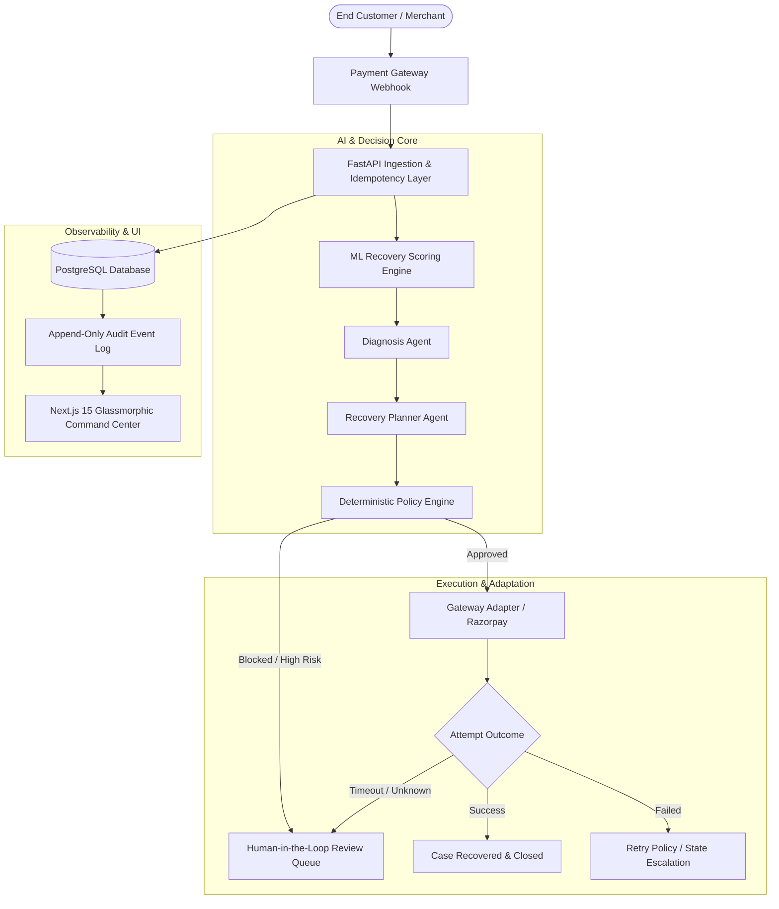

# RecoverAI Architecture & Technical Documentation

Welcome to the comprehensive documentation hub for **RecoverAI v3.2** — the Autonomous Revenue Recovery Operating System.

---

## 📚 Documentation Index

| Document | Description |
|---|---|
| [System Overview & Architecture](../README.md) | High-level overview, quickstart, system components, and workflow diagrams |
| [Database Architecture](database.md) | PostgreSQL schema, 21 relational tables, multi-tenant isolation, and state machine columns |
| [Entity Relationships](entity-relationships.md) | Foreign key diagrams, trace chains, and ER mapping across the recovery lifecycle |
| [API Contract & Endpoints](api-contract.md) | Complete REST API specification, request/response schemas, and error definitions |
| [AI Agent Architecture](ai-layer.md) | Multi-agent collaboration: Diagnosis Agent, Recovery Planner, and LLM reasoning |
| [Machine Learning Engine](ml.md) | Recovery scoring models, dataset generation, training pipeline, and feature engineering |
| [Action Adapters & Gateway Integration](action-adapters.md) | Razorpay payment adapter, retry mechanisms, idempotency keys, and webhook handling |
| [Simulation & Replay Engine](simulator.md) | Zero-risk sandbox execution, mock state transitions, and step-by-step audit replay |
| [Frontend Foundation & Design System](frontend-foundation.md) | Next.js 15 App Router architecture, glassmorphic UI system, and state management |

---

## 🏗️ System Architecture at a Glance

---

## 🛡️ Core Architectural Principles

1. **Deterministic Safety Guardrails**: AI agents propose; versioned policy engines dispose. No action reaches a payment gateway without passing hard business constraints.
2. **True Tenant Isolation**: Every merchant entity is strictly partitioned at the database query level via `merchant_id` foreign keys and tenant-isolated session middleware.
3. **Strict Idempotency**: All recovery attempts and gateway dispatches use deterministic idempotency keys (`UNIQUE(idempotency_key)`) to eliminate duplicate charges.
4. **Append-Only Auditability**: Every state transition, agent decision, policy evaluation, and adapter response is logged immutably in `audit_events`.
